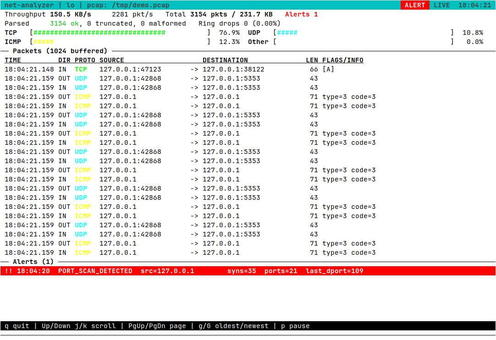

# net-analyzer

A raw-socket packet sniffer and protocol analyzer for Linux, written in C11.
It captures Ethernet frames with `AF_PACKET`, dissects L2/L3/L4 headers with
strict bounds checking, and shows them on an ncurses dashboard (or as plain
text). Capture and dissection run on separate threads connected by a lockless
ring buffer. A third thread renders the dashboard. It keeps live traffic
statistics, flags SYN port scans, and can write a standard `.pcap` file
without linking libpcap.



```
16:53:19.374512 OUT ICMP 127.0.0.1 -> 127.0.0.1 len=98 ttl=64 type=8 code=0 payload=56
16:53:20.411799 OUT UDP  127.0.0.1:59941 -> 127.0.0.1:9999 len=47 ttl=64 payload=5
16:53:20.430572 OUT TCP  127.0.0.1:42062 -> 127.0.0.1:47123 len=74 ttl=64 flags=[S] payload=0
16:53:20.430580 OUT TCP  127.0.0.1:47123 -> 127.0.0.1:42062 len=74 ttl=64 flags=[SA] payload=0
16:53:20.430584 OUT TCP  127.0.0.1:42062 -> 127.0.0.1:47123 len=84 ttl=64 flags=[PA] payload=18
17:22:08.798751 !!! ALERT PORT_SCAN_DETECTED src=127.0.0.1 syns=31 ports=31 window=1.0s last_dport=400
```

## Status

The roadmap is complete:

| Phase | What it adds |
|-------|----------------|
| 1 | Bounds-checked L2/L3/L4 dissector and an `AF_PACKET` capture loop |
| 2 | Lockless single-producer/single-consumer ring and a two-thread pipeline |
| 3 | Shared traffic metrics and a sliding-window SYN port-scan detector |
| 4 | libpcap-format writer (`-w`) and the ncurses dashboard on its own thread |

| Layer | Supported |
|-------|-----------|
| L2    | Ethernet II: MACs and EtherType. IPv6 and ARP are recognised but not dissected |
| L3    | IPv4: addresses, TTL, protocol, header length, fragmentation |
| L4    | TCP (ports, flags, header length, payload size), UDP (ports, length, payload size), ICMP (type, code) |

Truncated or malformed frames never cause out-of-bounds reads. The parser
reports them as `[truncated]` or `[malformed]` and keeps every field it could
decode safely. Non-first IPv4 fragments are shown as `FRAG` and their L4 is
not parsed.

## Architecture

```
AF_PACKET socket ──recvfrom──> [Thread 1: ingestion] ──> ring buffer ──> [Thread 2: dissector]
                                                                          parse_packet
                                                                          ana_record ──> shared metrics
                                                                          det_observe ─> alert ring
                                                                          feed_push ───> packet feed
                                                                          pcap_write ──> .pcap file (-w)
[Thread 3: ncurses, 10 Hz] <── ana_snapshot, feed_since, ana_alerts_since
[main thread: sigtimedwait(SIGINT, SIGTERM, SIGWINCH), 100 ms tick]
    ana_tick (rates), -s stats, resize flag, stop + join
```

- **Ring buffer** (`src/ring_buffer.c`): a single-producer / single-consumer
  ring with a power-of-two number of slots. Each slot holds a full
  `MAX_PACKET_LEN` (64 KiB) frame plus its captured length, on-wire length,
  capture timestamp, and packet type. All slots are allocated once with
  `mmap(MAP_POPULATE)` at startup, so the hot path never calls `malloc` and
  never page-faults. Head and tail are C11 atomics on separate cache lines,
  with acquire/release ordering, and each side caches the other's index.
- **Thread 1** reserves a slot and calls `recvfrom` directly into it, so there
  is one copy per frame. If the ring is full, the frame is read into a scratch
  buffer. If a slot has freed up by the time `recvfrom` returns, the frame is
  copied into it. Otherwise it is counted as a ring drop.
- **Thread 2** pops slots, parses and prints them, then releases them. When
  the ring is empty it yields, then sleeps for 100 µs.
- **Metrics** (`src/analyzer.c`): Thread 2 counts every frame: packets,
  on-wire bytes, TCP / UDP / ICMP / Other, and ok / truncated / malformed.
  The counters are C11 atomics with a single writer, published under a
  sequence lock, so `ana_snapshot()` returns a consistent set from any thread
  (for example, packets always equals the sum of the protocol counts) without
  ever blocking the dissector. The main thread calls `ana_tick()` every
  100 ms. It keeps the last 11 samples and publishes packets/s and bytes/s
  over the last second. Alerts go into a mutex-protected ring of the last 64,
  which readers poll incrementally with `ana_alerts_since()`.
- **Detector** (`src/detector.c`): see [Port-scan detection](#port-scan-detection).
- **Packet feed** (`src/feed.c`): a fixed ring of the last 1024 dissected
  frames for the dashboard. Each slot is a sequence lock over C11 atomics, so
  the dissector never waits on the UI thread. The UI skips a slot if the
  writer laps it mid-copy.
- **PCAP writer** (`src/pcap_writer.c`): classic libpcap format, no libpcap.
  The global header is magic `0xa1b2c3d4`, version 2.4, snaplen 65535,
  link type 1 (Ethernet). Each record stores `ts_sec`, `ts_usec` (from the
  capture timestamp), `incl_len` and `orig_len`. Frames longer than the
  snaplen are truncated in the file; `orig_len` keeps the on-wire length.
  The dissector writes records. It flushes when it goes idle, and the file
  is flushed and closed on shutdown.
- **Dashboard** (`src/ui.c`): ncurses (wide build) at 10 Hz. The top shows
  throughput, packet and byte totals, and TCP/UDP/ICMP/Other percentages.
  The middle is a scrollable feed of recent frames (time, direction,
  protocol, `src:port -> dst:port`, length, flags). The bottom highlights
  anomaly alerts. Input is non-blocking: `q` quits, arrows / `j` / `k` /
  Page Up / Page Down / `g` / `G` scroll, `p` pauses the feed. `SIGWINCH`
  is handled on the main thread and the UI resizes; `SIGINT` and `SIGTERM`
  restore the terminal before the summary is printed.
- **Signals**: `SIGINT`, `SIGTERM` and `SIGWINCH` are blocked in every
  thread, and the main thread alone receives them with `sigtimedwait`. On a
  stop request, Thread 1 exits within one 250 ms `SO_RCVTIMEO` tick. Thread 2
  then drains whatever is still queued, the UI thread exits within one
  frame, the terminal is restored, and the program prints a summary and
  exits with code 0.

## Requirements

- Linux with glibc
- GCC or Clang with C11 support, `make` (or CMake 3.16 or newer)
- ncurses (the wide build, `libncursesw`). Debian/Ubuntu:
  `sudo apt install build-essential libncurses-dev`
- `tcpdump` or `tshark` if you want to open the `.pcap` files
- Root or `CAP_NET_RAW` to capture

## Build

```sh
cd net-analyzer
make                    # produces build/net-analyzer
```

Or with CMake:

```sh
cmake -S net-analyzer -B build
cmake --build build
```

Everything is compiled with `-std=c11 -Wall -Wextra -Wpedantic -Werror -O2 -pthread`.

## Run

```sh
sudo ./build/net-analyzer -i lo              # dashboard on loopback
sudo ./build/net-analyzer -i eth0 -p         # eth0 in promiscuous mode
sudo ./build/net-analyzer -i eth0 -w eth0.pcap
sudo ./build/net-analyzer -c 100             # all interfaces, stop after 100 packets
sudo ./build/net-analyzer -i lo -n -q -b 1024
sudo ./build/net-analyzer -i eth0 -n -q -s   # console, alerts only, stats every second
```

When stdin and stdout are a terminal, and none of `-n`, `-q` or `-s` is
given, the program draws the dashboard. Otherwise it prints lines (console
mode), which is what you want from a script or a pipe.

| Option     | Meaning |
|------------|---------|
| `-i IFACE` | Capture only on `IFACE`. By default all interfaces are captured |
| `-c COUNT` | Stop after `COUNT` packets |
| `-b SLOTS` | Ring buffer slots, rounded up to a power of two, 2 to 16384 (default 256, which is 16 MiB) |
| `-w FILE`  | Also write every captured frame to `FILE` in classic libpcap format |
| `-p`       | Enable promiscuous mode on `IFACE` (requires `-i`) |
| `-n`       | Console mode: one line per packet instead of the dashboard |
| `-q`       | Console mode, quiet: dissect and count packets but do not print them. Alerts are still printed |
| `-s`       | Console mode, plus a traffic stats line (rates, totals, protocol mix, alerts) on stderr every second |
| `-h`       | Show help |

In the dashboard: `q` quits, Up/Down or `j`/`k` scroll one row, Page Up/Page
Down page, `g` jumps to the oldest buffered frame, `G` follows the live
tail, and `p` pauses the feed. Ctrl-C and `SIGTERM` also quit and restore
the terminal.

To run without sudo, grant the capability once:

```sh
sudo setcap cap_net_raw+ep ./build/net-analyzer
```

Stop with Ctrl-C or `SIGTERM`. The program drains the ring, closes the
socket, prints a summary and exits with code 0. On `lo` every packet appears
twice, once as `OUT` and once as `IN`, because the kernel loops it back.

```
[stats] 3994 pkt/s 218.4 KB/s | total 9194 pkts 854216 bytes | TCP 99.8% UDP 0.0% ICMP 0.2% Other 0.0% | alerts 1
...
10004 packets dissected: 10004 ok, 0 truncated, 0 malformed
traffic: 906886 bytes | TCP 9984, UDP 0, ICMP 20, Other 0
detector: 1469 SYNs from 1 tracked sources, 0 evicted, 2 alerts
ring (256 slots): 10004 queued, 0 dropped (0.000%), 0 left unprocessed
kernel: 10004 packets, 0 dropped by socket
```

The `[stats]` lines appear only with `-s`.

`ring ... dropped` counts frames Thread 1 read but had no free slot for.
`kernel ... dropped by socket` comes from `PACKET_STATISTICS` and counts frames
the kernel discarded because the socket receive buffer was full, meaning
Thread 1 was not calling `recvfrom` fast enough. `left unprocessed` is
non-zero only when `-c` stops the worker with frames still queued.

## Port-scan detection

The detector tracks, per IPv4 source address, the TCP connection attempts
(SYN set, ACK clear) it sent in the last 1.0 seconds and how many distinct
destination ports they targeted. A source is flagged `PORT_SCAN_DETECTED`
when, within that sliding window, **more than 30 SYNs** hit **more than 20
distinct ports**. Both conditions are required: a SYN flood against one
service or a browser opening many connections to port 443 does not alert,
and neither does a slow scan that stays under 31 SYNs per second.

- **Sliding, not bucketed.** Each source keeps the timestamps of its recent
  SYNs, and anything a full window old is expired on the next SYN. A burst
  split across a whole-second boundary is still caught.
- **Distinct ports** are kept incrementally in a small per-source hash
  multiset, updated as SYNs enter and leave the window, so each packet costs
  O(1).
- **Fixed memory.** The table holds 1024 sources (about 2.4 MiB, allocated
  once at startup). Lookup uses hash chains. When the table is full, the
  least recently active source is evicted, so a flood of one-off spoofed
  sources cannot push out an active scanner. Each source remembers its last
  128 SYNs, so the reported `syns=` saturates at 128, far above the threshold.
- **One alert per episode.** A source alerts when it first crosses both
  thresholds. While it stays above them it is re-reported at most every
  5 seconds. Once it drops below either threshold it is re-armed.
- Only frames the host received are checked. `OUT` frames are skipped, so
  loopback traffic, which is captured once as `OUT` and once as `IN`, is not
  counted twice. As a result, scans this host sends to other machines are
  not flagged.
- Timestamps are the capture times of the frames. If the wall clock steps
  backwards, the detector clamps to the latest time it has seen.

Validated live on `lo` (4-vCPU VM, nmap 7.94):

| Traffic | Result |
|---------|--------|
| 200 HTTP requests to one port, 8 other ports, `ping` | no alert |
| `nmap -sS --scan-delay 100ms -p 2000-2059` (10 SYN/s) | no alert |
| `nmap -sS -p 1-1000 127.0.0.1` | alert at the 31st SYN |
| `nmap -sT -p 3000-3200 127.0.0.1` (connect scan) | alert |

To try it yourself:

```sh
sudo ./build/net-analyzer -i lo -q -s &
sudo nmap -sS -Pn -p 1-1000 127.0.0.1
```

## Test

```sh
cd net-analyzer
make test               # parser, ring, detector, analyzer, pcap writer, feed
make sanitize           # the same tests under AddressSanitizer + UBSan
make tsan               # the threaded tests (ring, analyzer, feed) under ThreadSanitizer
```

With CMake, run `ctest --test-dir build`.

The tests use handcrafted frames: valid TCP, UDP, and ICMP, IP and TCP
options, Ethernet padding, fragments, and IPv6 and ARP EtherTypes. They also
cover malformed input: `ihl < 5`, `doff < 5`, bad IP versions, inconsistent
length fields, and truncation at every layer. Every prefix of each valid frame
is parsed from an exact-size heap buffer, and 200,000 random frames are fuzzed
through the parser, so the sanitizer build catches any over-read.

The ring buffer tests cover power-of-two rounding, FIFO order, full-ring
behaviour and drop accounting, wraparound, and full 64 KiB slots. They also
include a two-thread producer/consumer stress test. In lossless mode (8 and 2
slots) it pushes 1,000,000 frames and checks every one arrives in order with
intact contents and metadata. In lossy mode the producer drops when the ring
is full, and the test checks that `delivered + dropped == offered`. Set
`RB_STRESS_ITERS` to change the frame count; `make tsan` uses 200,000.

The detector tests cover the strict `> 30` and `> 20` boundaries, SYN floods
against one port, SYN-ACK / ACK / RST / UDP / IPv6 being ignored, exact
window expiry, slow scans, bursts that straddle a second boundary, a custom
window, the clock going backwards, and alert cadence (one per episode,
re-alert, re-arm). They also check LRU eviction order and that an evicted
source starts fresh. A churn test mixes 100,000 one-off sources with a
scanner, which is still detected, and another test runs 1024 simultaneous
scanners. Finally, 100,000 random SYNs cross-check the incremental
distinct-port count against a brute-force recount.

The analyzer tests cover protocol and status classification, rate
computation over the sliding 1 s sample window (including idle decay), and
alert ring overflow and incremental polling. A concurrent test runs one
writer, two snapshot readers, a ticker, an alert pusher, and an alert poller.
It checks that every snapshot is internally consistent and that alerts
arrive in order with none repeated. Set `ANA_STRESS_ITERS` to change the
packet count.

The PCAP tests check the global header (magic `0xa1b2c3d4`, version 2.4,
snaplen 65535, link type 1) and record headers byte for byte, including
microsecond rounding, snaplen clamping, and a `orig_len` that stays at least
`incl_len`. They round-trip a file, write 20,000 records across the stdio
buffer, and check that a write error becomes sticky and is reported by
`pcap_close`. A live capture on `lo` was also opened with `tcpdump -r`,
`tshark -r` and `capinfos` (Ethernet, microsecond timestamps, snaplen 65535).

The feed tests check incremental polling, overflow keeping the newest 1024
entries, and the column layout of `feed_format`. A two-thread stress test
checks that every entry a reader observes matches what the writer pushed.
Set `FEED_STRESS_ITERS` to change the count; `make tsan` uses 200,000.

On some Clang installs the sanitizer runtimes are missing. If `make sanitize`
or `make tsan` fails to link, use `make CC=gcc sanitize` or `make CC=gcc tsan`.

## Benchmark

`scripts/bench_loopback.sh` runs the analyzer on `lo` while `iperf3` pushes
traffic for a few seconds, then prints the drop summary. It covers several
ring sizes, with per-packet output either off (`-q`) or sent to `/dev/null`.

```sh
cd net-analyzer
make && sudo scripts/bench_loopback.sh 5          # SLOTS="8 256 1024" by default
```

Results from a 4-vCPU cloud VM (Intel Xeon, kernel 6.12, iperf3 3.16), with
iperf3 running on the same machine, 5 seconds per run. `TCP max` is a single
TCP stream at full speed; loopback GSO produces frames of up to 64 KiB, at
about 54 Gbit/s. `UDP 64B` is `-u -b 0 -l 64`, the smallest frames at the
highest packet rate, about 100 Mbit/s of payload. Frames per run were about
2.0 to 2.3 million, counting both `OUT` and `IN` copies. Ring and kernel drops
are percentages of the frames the socket saw.

| Traffic  | Slots | Output    | Ring drops | Kernel drops | Total loss |
|----------|------:|-----------|-----------:|-------------:|-----------:|
| TCP max  |     8 | quiet     |     13.10% |        0.41% |     13.46% |
| TCP max  |     8 | /dev/null |     17.59% |        0.50% |     18.00% |
| UDP 64B  |     8 | quiet     |      9.31% |        0.26% |      9.55% |
| UDP 64B  |     8 | /dev/null |     11.52% |        0.25% |     11.74% |
| TCP max  |   256 | quiet     |      0.14% |       18.33% |     18.45% |
| TCP max  |   256 | /dev/null |      0.03% |       14.29% |     14.32% |
| UDP 64B  |   256 | quiet     |      0.59% |        0.66% |      1.24% |
| UDP 64B  |   256 | /dev/null |      1.53% |        0.32% |      1.85% |
| TCP max  |  1024 | quiet     |     0.003% |       13.78% |     13.78% |
| TCP max  |  1024 | /dev/null |     0.005% |       10.19% |     10.20% |
| UDP 64B  |  1024 | quiet     |     0.018% |        0.85% |      0.86% |
| UDP 64B  |  1024 | /dev/null |      0.19% |        0.31% |      0.50% |

What this shows:

- An 8-slot ring overflows on short bursts. At 256 slots or more, ring drops
  fall below 2% for small frames and to almost zero for TCP, so the dissector
  keeps up with the ingestion thread.
- At 256 slots or more, TCP loss happens in the kernel, not the ring.
  Thread 1 makes one `recvfrom` syscall per frame and copies up to 64 KiB into
  a slot. At about 54 Gbit/s the default socket receive buffer (about 208 KiB,
  or 3 frames) overflows. The 8-slot run has lower kernel drops because its
  512 KiB of slots stays in cache, while 256 slots are 16 MiB.
- Output to `/dev/null` costs little. Printing to a real terminal is much
  slower and pushes ring drops up.
- Run-to-run variance is several percentage points, because iperf3 shares the
  same 4 vCPUs. Treat the numbers as orders of magnitude.

The next steps for ingestion are a larger `SO_RCVBUF` and, eventually, a
`PACKET_RX_RING` (TPACKET_V3) memory-mapped ring to remove the per-frame
syscall and copy.

## Layout

```
net-analyzer/
├── Makefile, CMakeLists.txt
├── include/   parser.h, ring_buffer.h, detector.h, analyzer.h, feed.h,
│              pcap_writer.h, ui.h, config.h
├── src/       main.c (threads, signals), parser.c, ring_buffer.c,
│              detector.c, analyzer.c, feed.c, pcap_writer.c, ui.c
├── scripts/   bench_loopback.sh (iperf3 drop-rate benchmark)
└── tests/     test_parser.c, test_ring_buffer.c, test_detector.c,
               test_analyzer.c, test_pcap_writer.c, test_feed.c
```

## License

[MIT](LICENSE) © Efe Güner
